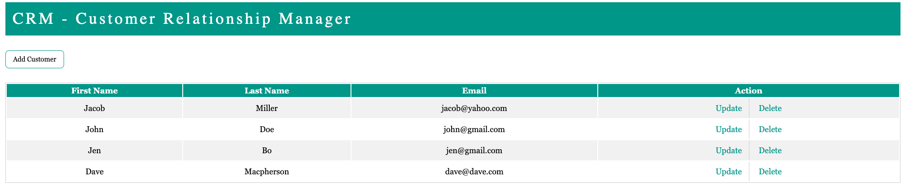
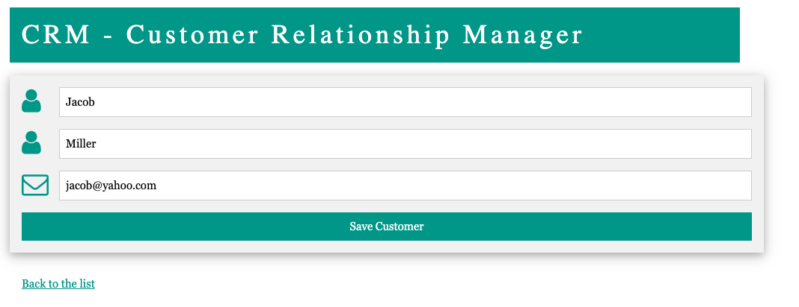

## Customer Relationship Management

A java web application to do CRUD on customers. It uses spring-boot framework along with JPA and hibernate to create, update, retrieve and delete customers.

  

  

